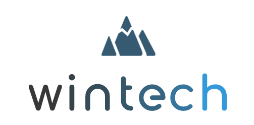

***

Did you know that 77% of trips to ski resorts are done by car, and over 50% of them have only one or two passengers on board? To solve this problem, we (Wintech) have developed a ride-sharing app that helps skiers travel more flexibly and sustainably by allowing drivers to rent their empty seats to passengers going the same way and even back. With our app, you can create or find a ride with only a push of a button. By sharing or joining a ride with others, you save money, meet new people and there is less traffic and CO2. 
Additionally, we have a Communities feature where users can connect with fellow skiers. They can share or join rides with specific groups they are part of and connect with others by sharing pictures and thoughts within their group. The app is completely free for everyone, so join us and help us shape the greenest winter sports community in the world! 

# About Wintech

WINTECH is an application wanting to help the DSV create a more sustainable future for Wintersports. The application we create helps to share your car or find a trip to a ski-region. We also connect people with our community feature. The DSV can also use the whole community function for their professional teams, to plan the rides more sustainable and get the teams together. We are a start-up that emerged after taking part in an international student challenge given by the Hochschule München and DSV. 

The goal of this competition was to shape a more sustainable future for winter sports fans with the help of a digital solution. After our research and the first teammeeting one potential issue that come with skiing, is the travelling to the mountains with the cars. You will find the explanation of our idea in the Storyboard below:

***

For any questions feel free to reach out to us.

Keep Shredding!

WINTECH <3
